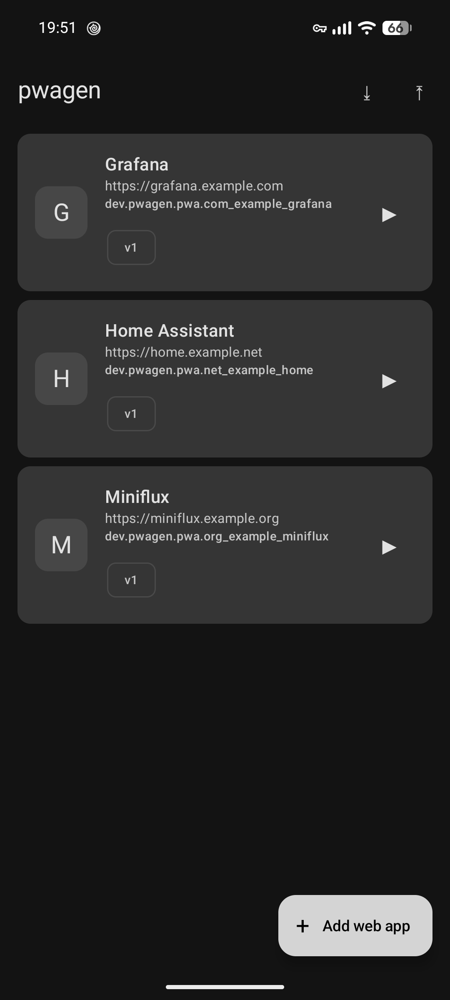
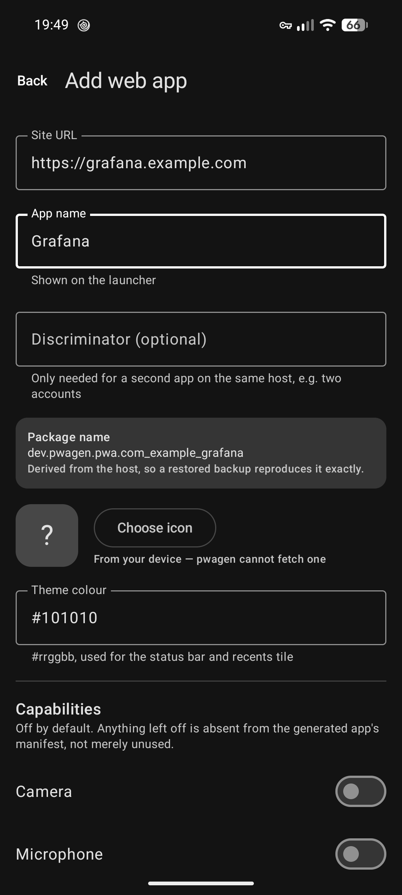
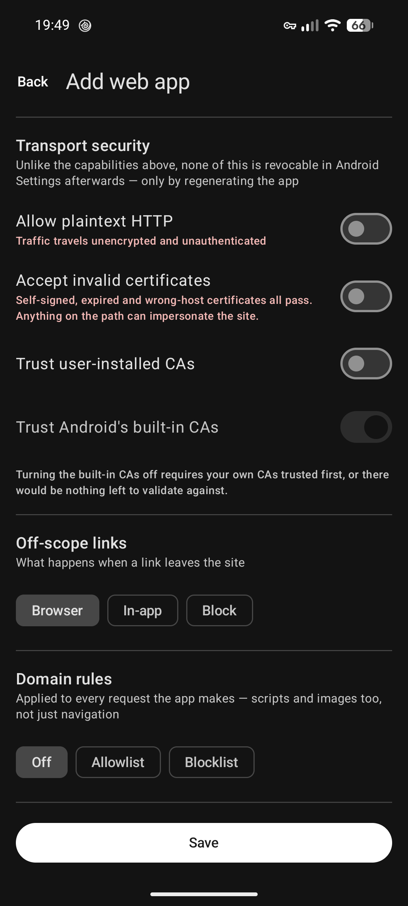

<div align="center">


# pwagen

**Turn a website into a real Android app — one package, one UID, its own firewall identity.**

[](LICENSE)
[](#requirements)
[](#the-generator-has-no-network-access)

</div>

---

## Why this exists

Android gives every installed APK exactly one UID, and per-app firewalls key their
rules to that UID. So a single app holding ten web apps has **one** network identity:
you cannot let your self-hosted dashboard reach the LAN while confining a chat client
to Wi-Fi, because to the firewall they are the same app.

pwagen takes the other route. Each web app you add is built into its own signed,
installable APK. That gives every site:

- **Its own UID** — so any per-app firewall controls it independently, with no
  integration and nothing to configure in pwagen.
- **Its own data sandbox** — cookies, storage and service workers isolated by the
  kernel, not by in-process bookkeeping.
- **Its own permissions** — camera, microphone and location granted and revoked per
  site in Android Settings, like any other app.
- **Its own launcher icon, name and recents entry** — because it *is* its own app.

## Screenshots

<div align="center">

<table>
<tr>
<td width="33%"></td>
<td width="33%"></td>
<td width="33%"></td>
</tr>
<tr>
<td align="center"><b>Your web apps</b><br><sub>Each row is one package that will be installed separately.</sub></td>
<td align="center"><b>Adding one</b><br><sub>The package name is derived from the host, so it is reproducible.</sub></td>
<td align="center"><b>Transport security</b><br><sub>Hardened by default; each relaxation says what it costs.</sub></td>
</tr>
</table>

</div>

## Install

<div align="center">

[](https://apps.obtainium.imranr.dev/redirect.html?r=obtainium://app/%7B%22id%22%3A%22dev.pwagen.app%22%2C%22url%22%3A%22https%3A%2F%2Fgithub.com%2Fddagunts%2Fpwagen%22%2C%22author%22%3A%22ddagunts%22%2C%22name%22%3A%22pwagen%22%7D)

</div>

Or add it manually in Obtainium with the URL `https://github.com/ddagunts/pwagen`,
or grab an APK from [Releases](https://github.com/ddagunts/pwagen/releases).

> [!IMPORTANT]
> **Pick one install source and stay on it.** pwagen's signing key lives in your
> device's hardware keystore and is tied to the installed app. Switching source later
> (say, a GitHub build to an F-Droid build) is an uninstall plus install, not an
> update — which destroys the key and forces every generated app to be reinstalled.
> Ordinary updates from the same source are completely safe.

## How it works

pwagen ships a tiny WebView shell as a template APK. For each web app you add it:

1. Rewrites the template's package name, label and version.
2. Adds **only** the permissions you opted into — everything else is simply absent.
3. Replaces the launcher icon at every density.
4. Embeds your settings as `assets/config.json`.
5. Signs the result with a hardware-backed key and hands it to the system installer.

`classes.dex` is byte-identical in every generated APK: the template names its
activity by fully-qualified name, so the code does not depend on the package it gets
rewritten to. Only the manifest, the icons, one asset and the signature ever differ.

## What a generated app does

Each generated app is one WebView, chromeless, pointed at one site — and nothing else.
It is the network-facing half of the project, so it is deliberately tiny: no Compose,
no AppCompat, no analytics, no dependencies beyond the shared config schema.

**Hardened by default.** Every relaxation is opt-in per site, and each one you enable
is still revocable afterwards in Android Settings:

| Setting | Default | Why |
|---|---|---|
| Safe Browsing | **off** | It reports visited URLs to Google |
| Third-party cookies | **off** | Cross-site tracking |
| File & content URL access | **off** | Reduces reachable local surface |
| Camera / microphone / location | **off** | Permission is absent from the manifest unless opted in |
| Mixed content | **blocked** | No silent downgrade to HTTP |
| JavaScript & DOM storage | on | Required for anything to work |

**Scope.** Links that leave the site open in your normal browser instead of loading
inside the app, so unrelated browsing never lands under that app's UID.

**Pull to refresh.** Dragging down with the page already at its top reloads it. The
gesture is only claimed while the page has nowhere left to scroll and is abandoned the
moment it moves or a second finger lands, so it cannot swallow a swipe the site wanted.

**Full screen.** On by default: the system bars are hidden and the site gets the whole
screen, with a swipe from the top edge bringing the status bar back. Turn it off and
the bars stay put with the page held below them, tinted with the site's theme colour.
There is no in-between state, because a page drawn under a *visible* status bar has a
band across its top that looks live but sends every tap to the system instead.

Hiding the bars does not move the camera, so a full-screen app still stops below the
display cutout and fills that strip with the theme colour. *Draw under the camera
cutout* gives the strip back to the page — worth it for a site whose top edge is empty,
and not otherwise, since unlike a status bar there is no swipe that reveals what the
lens covers.

## Domain rules

Each site can carry its own allowlist or blocklist, applied to **every** request it
makes — scripts, images, XHR and fetch, not just navigation. Blocked requests get a
real 403, so failures surface in the page's own error handling rather than silently
appearing as empty content.

| Pattern | Matches | Does not match |
|---|---|---|
| `example.com` | `example.com` | `cdn.example.com` |
| `*.example.com` | `cdn.example.com`, `a.b.example.com` | `example.com` |
| `ads.*.example.com` | `ads.eu.example.com` | `cdn.eu.example.com` |
| `*` | everything | — |

`*` is the only metacharacter; everything else is literal, so a dot is a dot. To cover
a domain *and* its subdomains, list both forms — pwagen seeds exactly that pair when
you first switch a site to allowlist mode.

There are deliberately **no implicit rules**. An empty allowlist blocks the site's own
requests too. What you see in the config is what is enforced, with no hidden
exceptions to reason around.

**Seeing what got blocked.** A rule that is working refuses things constantly, so by
default refusals go only to logcat. Turn on *Announce blocked requests* while you are
tuning a list and the app names each refused host the first time it comes up, with a
**Mute** button that silences that host for good — so the answer to "what did I forget
to allow?" does not cost you a page that complains forever. Muting is remembered
inside the generated app; clearing its storage in Android Settings resets it.

This sits *underneath* whatever per-app firewall you use rather than replacing it. A
firewall sees the app's UID and can stop it reaching a host at all; these rules work
inside the app, where the origin of each individual request is still known.

## Transport security

A generated app is HTTPS-only and validates against Android's built-in CAs, which is
all most sites need. Self-hosted setups sometimes need less, so each site can also
carry:

| Setting | Default | What turning it on means |
|---|---|---|
| Plaintext HTTP | **off** | `http://` works, and HTTPS pages may pull in HTTP subresources. Traffic is unencrypted and unauthenticated |
| Accept invalid certificates | **off** | Self-signed, expired and wrong-host certificates all pass. Anything on the path can impersonate the site |
| Trust user-installed CAs | **off** | Your own or a corporate root is accepted alongside the built-in set |
| Trust Android's built-in CAs | on | Off — available only once your own CAs are trusted — accepts nothing but the CAs you installed yourself |

Unlike the capabilities above, **none of this is revocable in Android Settings**.
Plaintext and the trust anchors are baked into the generated APK's network security
config, and there is no toggle that puts them back; the only way to undo one is to
regenerate the app. That is also why they are per-site: a lab box on a self-signed
certificate gets its own exception without any of it reaching your bank.

For a self-signed setup, install the site's CA on the device and trust user CAs rather
than accepting invalid certificates. Both get the site loading, but the first still
authenticates the server.

## The generator has no network access

pwagen declares no `INTERNET` permission. Not "does not use the network" — **cannot**.
You can verify it yourself:

```console
$ aapt2 dump badging pwagen.apk | grep uses-permission
uses-permission: name='android.permission.REQUEST_INSTALL_PACKAGES'
uses-permission: name='dev.pwagen.app.DYNAMIC_RECEIVER_NOT_EXPORTED_PERMISSION'
```

That is the complete list. The first is how pwagen installs the apps it builds; the
second is a signature-level permission pwagen defines on *itself*, which AndroidX adds
so that its internal broadcast receivers are not exported to other apps. Neither
grants network access.

This is why pwagen never fetches a site's web app manifest to autofill its name and
icon: you supply both from your device. That is a real cost in convenience, accepted
on purpose. The tool that builds and signs your isolated apps should not itself be
able to phone home.

## Signing and backup

Generated APKs are signed with an EC P-256 key created in the Android Keystore
(StrongBox where available). The private key is **non-exportable** — apksig only ever
calls `Signature.initSign()`, so signing happens inside the TEE and the key never
enters app memory.

The key survives every ordinary app update. It is destroyed only by uninstalling
pwagen or switching install source.

**Backups contain your configuration and icons — never the key.** On a new device you
import the backup, pwagen mints a fresh key, and regenerates every app. Package names
are derived deterministically from each site's host, so a restored backup reproduces
*identical* package names and your firewall rules still apply by name.

## Requirements

- **Android 11+** (API 30)
- Built for **GrapheneOS**, where the system WebView is Vanadium — works on stock
  Android too, with whatever WebView is installed.
- "Install unknown apps" permission, since pwagen installs the APKs it generates.

## Building

No system JDK is required if you have Android Studio; its bundled JBR is enough.

```bash
export JAVA_HOME=/path/to/android-studio/jbr
./gradlew :app:assembleRelease
```

The generator embeds `:shell`'s unsigned release APK as an asset, built in the same
invocation — the template is never checked in, so the shell runtime and the generator
that ships it cannot drift apart.

### Tests

The generation pipeline is pure Java and runs entirely on the desktop JVM. Its tests
generate real APKs and verify them with the same `aapt2`, `apksigner` and `zipalign`
that Android ships, because the mistakes that matter here — a compressed
`resources.arsc`, a misaligned entry, a malformed signature — produce files that look
fine and then fail to install on a real phone.

```bash
./gradlew :config:test :app:testDebugUnitTest
```

## Project layout

| Module | Role |
|---|---|
| `:app` | The generator. Compose UI, APK rewriting and signing. No `INTERNET`. |
| `:shell` | The WebView runtime. Becomes the template APK. Network-facing, kept minimal. |
| `:config` | Config schema and domain matcher, shared by both. |

## Licence

[GPL-3.0-only](LICENSE). Copyleft is deliberate for a privacy tool: a closed,
subtly-altered fork is precisely the thing worth guarding against.
